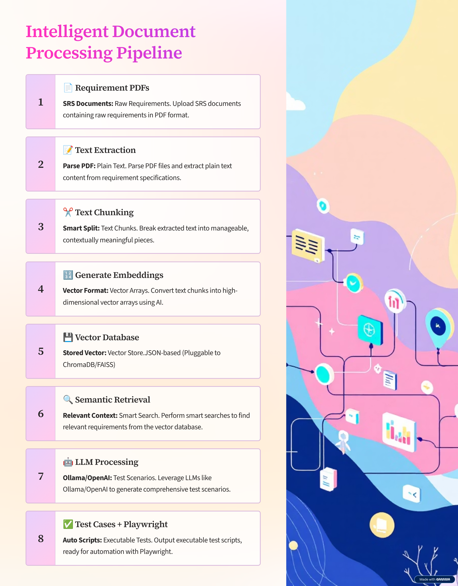

# genai-qa-capstones
Industry-grade GenAI and Agentic AI capstone projects for QA automation

## 🧠 Architecture Overview — GenAI QA Test Case Generator

This project implements an **end-to-end Retrieval-Augmented Generation (RAG) pipeline** to automatically derive QA test cases and automation-ready outputs from requirement documents.

### Pipeline Flow

1. **Requirement PDFs**
   - Input Software Requirement Specification (SRS) documents in PDF format.

2. **Text Extraction**
   - Parse and extract raw text from PDFs using Python-based ingestion.

3. **Text Chunking**
   - Split extracted text into smaller, semantically meaningful chunks.

4. **Embedding Generation**
   - Convert text chunks into vector embeddings using sentence-transformer models.

5. **Vector Store (JSON-based)**
   - Store embeddings in a lightweight **JSON-based vector store** for fast, local semantic search.
   - Designed for transparency, portability, and demo-first workflows.

6. **Semantic Retrieval**
   - Retrieve the most relevant requirement chunks based on user queries or prompts.

7. **LLM Processing (Local or Cloud)**
   - Pass retrieved context to an LLM (Ollama / OpenAI / Azure OpenAI).
   - Generate human-readable test scenarios using plain English prompts.

8. **Test Case & Playwright Generation**
   - Convert LLM output into structured test cases.
   - Generate Playwright automation skeletons ready for execution.

### Design Philosophy

- **Local-first & transparent**
- **No black-box frameworks**
- **QA-focused, not demo-driven**
- **Easily extensible to vector DBs (FAISS, Chroma, etc.) when needed**
  
- ## ⚠️ Disclaimer

This repository is a **learning-focused, demonstration project** created to showcase applied skills in:

- Generative AI
- Retrieval-Augmented Generation (RAG)
- Intelligent QA automation
- LLM-assisted test case generation

### Important Notes

- This project is **not intended as a production-ready framework**.
- It does **not include proprietary data, secrets, or enterprise integrations**.
- The primary purpose is to demonstrate **architecture, reasoning, and workflow design**, not to distribute a reusable commercial solution.

### Usage

- You are welcome to **review, learn, and experiment** with this code for educational purposes.
- **Commercial usage or redistribution** without explicit permission is not allowed.

If you are a recruiter or hiring manager:
> This repository represents how I **think, design, and evolve systems**, not just the final output.
