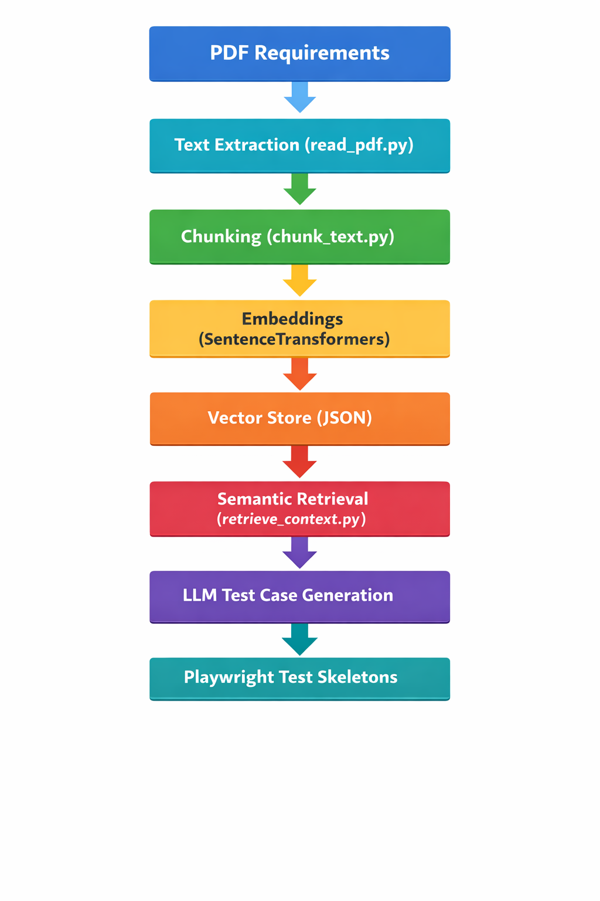

# Project 1: AI Test Case Generator using RAG

## Problem
Manual test case design from requirement documents is time-consuming and error-prone.

## Solution
An AI-powered pipeline that ingests requirement documents, retrieves relevant context using RAG,
and generates structured test cases and Playwright-ready automation skeletons.

## Architecture
PDF → Text Extraction → Chunking → Embeddings → Semantic Retrieval → LLM-based Test Generation

## Key Capabilities
- Requirement document ingestion (PDF)
- Text chunking with overlap for RAG
- Embedding generation using SentenceTransformers
- Semantic retrieval via cosine similarity
- LLM-driven test case generation
- Playwright automation-ready output

## Tech Stack
- Python
- SentenceTransformers
- Retrieval-Augmented Generation (RAG)
- Agent-based orchestration
- Playwright (output)

## Status
Completed core pipeline. LLM integration can be swapped with OpenAI / Azure / local models.

## Architecture Diagram

## How to Run (Local)
1. Place a requirement PDF in the `data/` folder
2. Run `read_pdf.py` to extract text
3. Run `chunk_text.py` to create chunks
4. Run `embed_chunks.py` to generate embeddings
5. Run `retrieve_context.py` for semantic retrieval
6. Run `generate_testcases.py` to create test cases
7. (Optional) Run `generate_playwright_tests.py` for automation output
